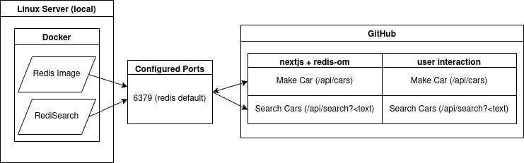

This is a [Next.js](https://nextjs.org/) project bootstrapped with [`create-next-app`](https://github.com/vercel/next.js/tree/canary/packages/create-next-app).

## Getting Started

First, run the development server:

```bash
npm run dev
# or
yarn dev
```

Open [http://localhost:3000](http://localhost:3000) with your browser to see the result.

**Diagram of project**




redis-om - https://github.com/redis/redis-om-node

redis docker image - https://hub.docker.com/_/redis/

redisearch docker image - https://hub.docker.com/r/redislabs/redisearch/

bootstrap - https://docs.docker.com/engine/reference/commandline/exec/
